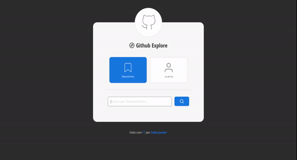

### :collision: Github Explorer

---
Projeto realizado para estudos em TypeScript, API do integrações do Github e React. Com inspiração e evolução de uma aplicação construída em uma das primeiras semanas de conteúdo OmniStack da RocketSeat ([Link AQUI](https://github.com/clsjunnior/Busca-Repositorios-GithubAPI)).

O layout foi construído do zero, mostrando grande evolução para a versão 1.0 feita anteriormente.

:link: [Projeto Online Aqui!](https://clsjunnior.github.io/github-integrations-v2/)

### :checkered_flag: Instruções

---

**Download do projeto**

> git clone https://github.com/clsjunnior/github-integrations-v2.git

**Instalar bibliotecas**

> yarn

**Iniciar aplicação**

> yarn start

:heart: Feito por [Celso Junnior!](https://www.linkedin.com/in/celso-junior/)

